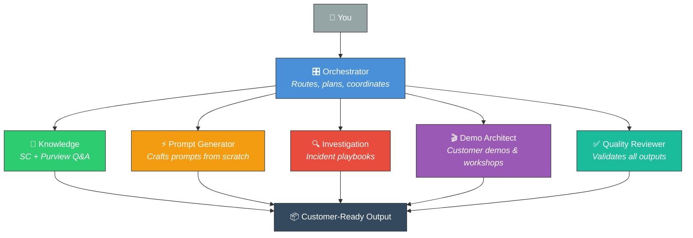

# ⚒️ Copilot Forge — Purview Data Security

> **AI-powered prompt engineering & investigation framework for Microsoft Security Copilot + Purview**

A field-ready **6-agent system** with **9 prompt books** for Data Security CSAs, analysts, and administrators to generate and operationalize Security Copilot prompts, agents, and promptbooks for Purview data security investigations.

---

## 🧠 What Is Copilot Forge?

A complete **6-agent AI system** that can handle any Security Copilot + Purview request — from scratch.

**Describe what you need in plain language. The agents do the rest.**

| 💬 You say... | 🤖 Agent responds... |
|---|---|
| *"Can SC detect USB file copies?"* | 🧪 **Knowledge Agent** answers with capabilities, limitations, and example prompts |
| *"Generate prompts for healthcare DLP triage"* | ⚡ **Prompt Generator** crafts production-ready SC prompts from scratch |
| *"Investigate: employee downloaded 500 files"* | 🔍 **Investigation Agent** builds a complete playbook with decision trees |
| *"Prepare a demo for a financial services CISO"* | 🎯 **Demo Architect** designs scenarios, scripts, and hands-on labs |
| *"I need triage + investigation + reporting + workshop"* | 🎛️ **Orchestrator** splits the work across all agents, delivers unified output |
| *"Validate these prompts before I show the customer"* | ✅ **Quality Reviewer** checks everything against real SC capabilities |

**Core purpose:** Help CSAs scale the use of Security Copilot for data security investigations with their customers.

---

## 👥 Who This Is For

| Role | How You'll Use It |
|------|-------------------|
| 🛡️ **Data Security CSAs** | Design and deploy SC + Purview solutions for customers |
| 🔎 **SOC Analysts & Investigators** | Triage incidents, manage cases, investigate threats |
| 📋 **Compliance Officers & Admins** | Run data governance workflows, policy hygiene |
| 📊 **Security Leadership (CISO/CTO)** | Evaluate SC's operational impact, board-level reporting |

---

## 🚀 Getting Started

### ⚡ Fastest Path: Talk to the Agents

Go to **[agents/AGENT-HUB.md](agents/AGENT-HUB.md)** and describe what you need. That's it.

### 🗺️ By Task

| I want to... | Go Here |
|---|---|
| 🎯 Talk to the agents (start here) | [Agent Hub](agents/AGENT-HUB.md) — single entry point |
| ⚡ Generate prompts from scratch | [Prompt Generator Agent](agents/prompt-generator-agent.md) |
| 🧪 Get answers about SC capabilities | [Knowledge Agent](agents/knowledge-agent.md) |
| 🔍 Investigate a security incident | [Investigation Agent](agents/investigation-agent.md) |
| 🎬 Prepare a customer demo | [Demo Architect Agent](agents/demo-architect-agent.md) |
| ✅ Validate prompts before delivery | [Quality Reviewer Agent](agents/quality-reviewer-agent.md) |
| 🎛️ Handle a complex multi-part request | [Orchestrator Agent](agents/orchestrator-agent.md) |
| 📖 Use pre-built prompt books | [prompts/](prompts/) — 9 domain-specific books |
| 📘 Build a custom promptbook | [USAGE-GUIDE.md](USAGE-GUIDE.md) |
| 🏗️ Learn the technical architecture | [ARCHITECTURE.md](ARCHITECTURE.md) |
| 💻 Use Claude Code with this framework | [GETTING-STARTED-CLAUDE-CODE.md](GETTING-STARTED-CLAUDE-CODE.md) |

---

## 🤖 The 6-Agent System



| Agent | What It Does | File |
|-------|-------------|------|
| 🎛️ **Orchestrator** | Receives ANY request, plans approach, coordinates agents | [orchestrator-agent.md](agents/orchestrator-agent.md) |
| 🧪 **Knowledge** | Answers SC + Purview capability questions with precision | [knowledge-agent.md](agents/knowledge-agent.md) |
| ⚡ **Prompt Generator** | Generates production-ready SC prompts from scratch | [prompt-generator-agent.md](agents/prompt-generator-agent.md) |
| 🔍 **Investigation** | Builds incident response playbooks with SC prompts | [investigation-agent.md](agents/investigation-agent.md) |
| 🎬 **Demo Architect** | Designs customer demos, workshops, hands-on labs | [demo-architect-agent.md](agents/demo-architect-agent.md) |
| ✅ **Quality Reviewer** | Validates everything against real SC capabilities | [quality-reviewer-agent.md](agents/quality-reviewer-agent.md) |

---

## 📂 Repository Structure

```
📁 Copilot Forge
│
├── 📄 README.md                        ← you are here
├── 📄 GETTING-STARTED-CLAUDE-CODE.md   ← from zero to productive in 5 min
├── 📄 USAGE-GUIDE.md                   ← practical how-to guide
├── 📄 ARCHITECTURE.md                  ← design principles & system architecture
├── 📄 CONTRIBUTING.md                  ← how to add content
├── 📄 ROADMAP.md                       ← planned features & enhancements
│
├── 🤖 agents/                          ◄◄◄ THE 6-AGENT SYSTEM
│   ├── AGENT-HUB.md                    ← START HERE — single entry point
│   ├── orchestrator-agent.md           ← routes, plans, coordinates
│   ├── knowledge-agent.md              ← answers SC + Purview questions
│   ├── prompt-generator-agent.md       ← generates SC prompts from scratch
│   ├── investigation-agent.md          ← builds incident response playbooks
│   ├── demo-architect-agent.md         ← designs customer demos & workshops
│   ├── quality-reviewer-agent.md       ← validates all outputs
│   ├── architecture.md                 ← multi-agent design document
│   ├── examples/                       ← scenario walkthroughs
│   └── topologies/                     ← deployment patterns (3, 5, 6 agents)
│
├── 📝 prompts/                         ◄◄◄ 9 PROMPT BOOKS
│   ├── dlp/prompt-book.md              ← Data Loss Prevention
│   ├── irm/prompt-book.md              ← Insider Risk Management
│   ├── dspm/prompt-book.md             ← Data Security Posture Management
│   ├── audit/prompt-book.md            ← Audit & forensics
│   ├── mip/prompt-book.md              ← Information Protection & labels
│   ├── executive/prompt-book.md        ← Leadership reporting
│   ├── workshop/prompt-book.md         ← Customer demos & training
│   ├── operations/prompt-book.md       ← Daily operational hygiene
│   ├── dfir/prompt-book.md             ← DFIR deep investigation (40 prompts)
│   ├── taxonomy.md                     ← prompt classification & patterns
│   └── validation-matrix.md            ← testing status of all prompts
│
├── 🔍 playbooks/                       ◄◄◄ INVESTIGATION PLAYBOOKS
│   ├── dlp-incident-investigation.md   ← step-by-step DLP incident response
│   ├── irm-case-triage.md              ← IRM case classification workflow
│   ├── data-leakage-response.md        ← cross-product leak response
│   └── post-incident-review.md         ← after-action analysis
│
├── 📚 docs/                            ◄◄◄ TECHNICAL DEEP DIVES
│   ├── vision-and-scope.md             ← what we're building and why
│   ├── personas.md                     ← detailed role definitions
│   ├── knowledge-architecture.md       ← how knowledge flows through SC
│   ├── plugin-dependency-map.md        ← prompt-to-plugin mapping
│   ├── reference/
│   │   ├── audit-log-operations.md     ← exact audit log operation names
│   │   └── sensitive-information-types.md ← exact SIT names
│   └── technical-deep-dives/
│       ├── Purview.md                  ← Purview data flows & signals
│       ├── security-copilot-mechanics.md ← SC internals & capabilities
│       └── limitations-and-blind-spots.md ← honest assessment of gaps
│
├── 📋 use-cases/                       ◄◄◄ 22 MAPPED SCENARIOS
│   └── catalog.md                      ← scenarios with success criteria
│
├── 📐 templates/                       ◄◄◄ CONTENT TEMPLATES
│   ├── prompt-template.md
│   ├── playbook-template.md
│   ├── use-case-template.md
│   └── agent-definition-template.md
│
└── 📌 backlog/                         ◄◄◄ FUTURE WORK
    └── roadmap-backlog.md
```

---

## ⚙️ Prerequisites

### 🔑 Access & Licensing
- **Security Copilot access** (assigned via Microsoft Security admin center)
- **Purview role assignment** (DLP Admin, IRM Admin, or equivalent)
- **SCU capacity** for your tenant (each prompt/agent call costs SCUs)
- **Commercial cloud** (FedRAMP High commercial is GA; GCC not yet)

### 🔧 Configuration
- **Purview plugin enabled** in SC (Sources > Plugins > Purview toggle)
- **Appropriate RBAC** in Purview for your role
- **DLP active mode policies** (DLP Triage Agent does not work with simulation mode)

### 💡 Recommended
- SC experience or familiarity with copilot-driven investigation
- Understanding of your Purview policies (DLP, IRM, sensitivity labels)
- A test tenant for experimenting with new prompts

---

## 🗂️ Quick Navigation by Role

| Role | Start Here | Then Use |
|------|-----------|----------|
| 🛡️ CSA / Pre-sales | [USAGE-GUIDE.md](USAGE-GUIDE.md) | [Workshop Prompts](prompts/workshop/prompt-book.md) |
| 🔎 Analyst / Investigator | [Playbooks](playbooks/README.md) | [DLP](prompts/dlp/prompt-book.md) + [IRM](prompts/irm/prompt-book.md) prompt books |
| ⚙️ Security Admin | [Agents Docs](agents/README.md) | DLP & IRM Triage Agent setup |
| 📋 Data Security Admin | [Operations](prompts/operations/prompt-book.md) | [MIP](prompts/mip/prompt-book.md) policy hygiene |
| 📊 Executive / CISO | [Vision](docs/vision-and-scope.md) | [Executive Reporting](prompts/executive/prompt-book.md) |

---

## 🔌 Core SC + Purview Capabilities

> These are the **6 validated plugin capabilities** that all prompts in Copilot Forge map to.

| Capability | What It Does |
|-----------|-------------|
| 🟢 **Get Data Risk Summary** | MIP + DLP risk attributes for data in alerts |
| 🟢 **Get User Risk Summary** | IRM user risk profile, exfiltration indicators |
| 🟢 **Summarize Purview Alert** | One-liner alert summary with key facts |
| 🟢 **Triage Purview Alerts** | Top/recent DLP alerts ranked by risk |
| 🟢 **Zoom Into Purview Data Risk** | Deep-dive data risk attributes and policy matches |
| 🟢 **Zoom Into Purview User Risk** | Deep-dive user activities, anomalies, sequences |

**SC Agents (Preview):** DLP Triage Agent | IRM Triage Agent | DSPM Posture Agent | DSI Agent

---

## 🤝 How to Contribute

See [CONTRIBUTING.md](CONTRIBUTING.md) for detailed guidance.

- 📝 **New prompts** — Test in your environment, document with examples
- 📓 **New playbooks** — Include SC prompts, decision trees, success criteria
- 💡 **Field learnings** — Document limitations, workarounds, customer feedback
- 🐛 **Bug reports** — File as issues with reproduction steps

All contributions must be honest about what works, what doesn't, and what the actual limitations are.

---

## ⚠️ Status & Disclaimer

> **Internal Use Only | Work in Progress**

This framework represents field guidance and best practices developed by Microsoft Cloud Solution Architects. It is:

- **Not** official Microsoft product documentation
- **Not** covered by Microsoft support agreements
- **Subject to change** as SC and Purview capabilities evolve
- **Your responsibility** to validate in your own environment

Content reflects capabilities as of **April 2026** and may not reflect future releases.

---

## ➡️ Next Steps

1. 🎯 Go to [agents/AGENT-HUB.md](agents/AGENT-HUB.md) and describe what you need
2. 💻 Or read [GETTING-STARTED-CLAUDE-CODE.md](GETTING-STARTED-CLAUDE-CODE.md) for setup
3. 📖 Browse [prompts/](prompts/) for pre-built prompt books
4. 🧪 Test in your environment before customer engagement

---

**Author:** Bilel Azaiez — Microsoft Cloud Solution Architect, with AI-assisted development
